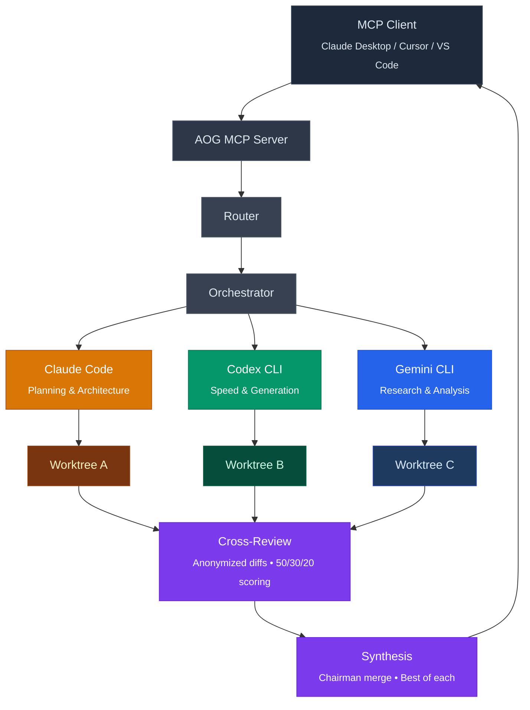
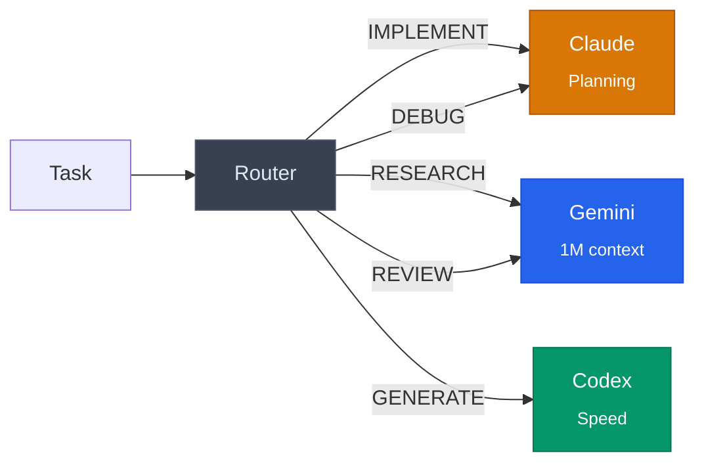
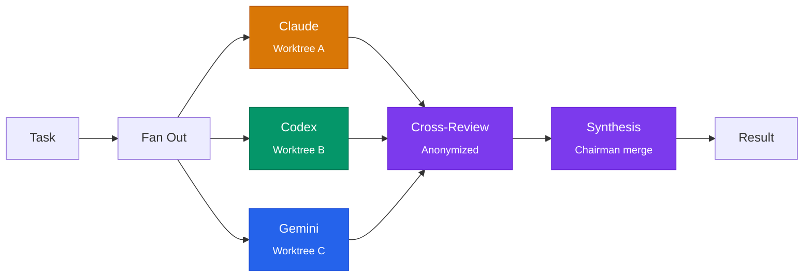
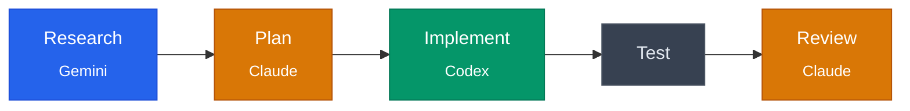

[](LICENSE)
[](https://nodejs.org)
[](https://www.typescriptlang.org)

# AOG — Multi-Agent CLI Orchestrator

**AOG** (Anthropic, OpenAI, Google) is an open-source MCP server that orchestrates Claude Code, Codex CLI, and Gemini CLI as a collaborative multi-agent coding team. Multiple models work the same problem independently, then cross-review and synthesize — applied to CLI coding agents working on real code.



## See It In Action

A single `council_run` dispatched the same task to Claude and Gemini in parallel worktrees:

```mermaid
gantt
    title council_run: "Create getHealth() endpoint"
    dateFormat X
    axisFormat %s

    section Claude
    Spawn & implement     :claude, 0, 9
    section Gemini
    Spawn & implement     :gemini, 0, 10
    section Cross-Review
    Anonymize & review    :review, 10, 40
    section Synthesis
    Score & merge         :synth, 40, 50
```



| Agent | What It Built | Time |
|-------|--------------|------|
| **Claude** | Clean 9-line `getHealth()` using `Date.now()` | ~9s |
| **Gemini** | 15-line version with JSDoc, `process.uptime()`, AND wrote tests unprompted | ~10s |

Both implementations were anonymized and cross-reviewed. The chairman merged the best parts of each. Total time: ~2 minutes.

## Prerequisites

- **Node.js** >= 20
- **Git** (for worktree isolation)
- At least one of:
  - [Claude Code](https://claude.ai/code) (Claude Max subscription)
  - [Codex CLI](https://openai.com/codex) (ChatGPT Plus/Pro subscription)
  - [Gemini CLI](https://github.com/google-gemini/gemini-cli) (Google account, free tier)

> **Don't have all three?** AOG works with any subset — even just one CLI.
> Delegate mode routes tasks to whatever you have installed. Multi-agent
> modes unlock when you have two or more.

## Quick Start

```bash
# Install and register with Claude Code
claude mcp add --transport stdio aog -- npx -y @aog/mcp-server

# Or register with Codex CLI
codex mcp add aog -- npx -y @aog/mcp-server

# Or add to Gemini CLI (~/.gemini/settings.json)
# { "mcpServers": { "aog": { "command": "npx", "args": ["-y", "@aog/mcp-server"] } } }
```

Then ask your AI coding agent:
> "Use the council_run tool to implement a rate limiter for the API endpoints"

## Three Modes

### DELEGATE — Single Agent Routing

Routes each task to the best available CLI:



### COUNCIL — Multi-Agent Consensus

Fan out to all agents in parallel, cross-review anonymized diffs, synthesize:



1. Each agent gets an isolated git worktree
2. All agents implement the task simultaneously
3. Tests run in each worktree
4. Agents cross-review anonymized diffs (Implementation A/B/C)
5. Chairman merges the best parts into the final implementation

### PIPELINE — Staged Workflows

Chain specialized agents across multiple stages:



Built-in templates:

| Template | Stages |
|----------|--------|
| **full-council** | implement → test → review → synthesize → final test |
| **quick-fix** | fix → test → review |
| **migration** | research → plan → approve → implement → test → review → synthesize |
| **dependency-update** | analyze → update → test → review |
| **research-synthesis** | synthesize research → plan → approve → build |

The **research-synthesis** pipeline is the simplest way to start: drop research
outputs from multiple LLMs into a `research/` folder, then let AOG synthesize
and build from the plan.

## Security

AOG follows the principle of least privilege:

- **Spawns official CLI binaries only** — no OAuth token extraction, no SDK auth hacks
- **Git worktree isolation** — each agent works in its own directory
- **Output sanitization** — strips prompt injection patterns between agents
- **Approval gates** — configurable human-in-the-loop at critical pipeline stages
- **Audit logging** — all operations logged to `.aog/sessions/`

## Configuration

Create `aog.config.yaml` in your project root:

```yaml
agents:
  claude:
    enabled: true
    model: sonnet          # or claude-sonnet-4-6
    maxTurns: 20
    maxBudgetUsd: 5.0
  codex:
    enabled: true
    model: gpt-5.4         # or your preferred model
  gemini:
    enabled: true
    model: gemini-2.5-pro   # override with your available model

defaults:
  chairman: claude
  timeout: 300000
  pipeline: full-council

security:
  require_approval_before_merge: true
  allow_permission_bypass: false
  max_parallel_agents: 3
  max_budget_per_task_usd: 10.0
  audit_logging: true
```

## Development

```bash
git clone https://github.com/LonglifeIO/AOG.git
cd AOG
npm install
npm run build   # Compile TypeScript
npm run dev     # Start MCP server with tsx
```

## Project Structure

```
src/
├── server.ts              # MCP server — 5 tool definitions
├── agents/                # Claude, Codex, Gemini spawners
├── council/               # Fan-out, cross-review, synthesis
├── pipeline/              # YAML template engine, state machine
├── router/                # Task type → agent routing
├── interaction/           # Decision gates, liveness, progress
├── conflict/              # File scoping, overlap detection
├── dispatch/              # Worker environment setup
└── utils/                 # Output parsers, config, sanitization
```

## Not Yet Built

- Unit tests (vitest configured, no test files yet)
- `aog init` setup wizard
- Container isolation mode
- Pipeline resume after pause
- Metrics / learned adaptive routing

## Contributing

This project is in early development. Issues, bug reports, and PRs welcome.
See `docs/decisions/` for architecture context before making major changes.

## License

MIT
