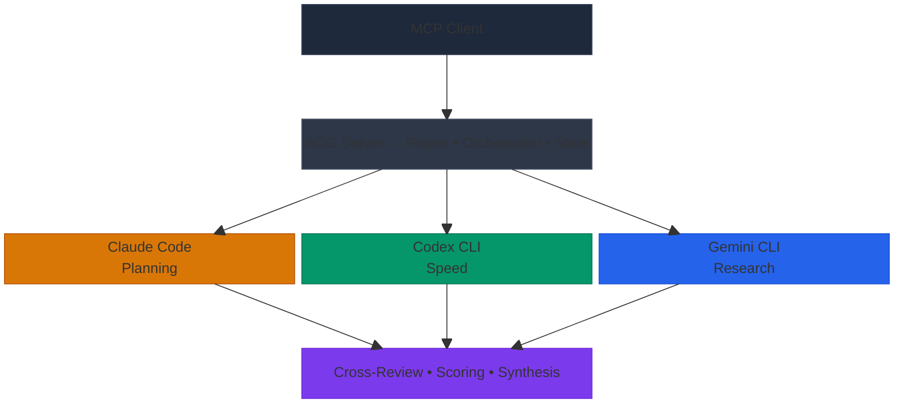

[](LICENSE)
[](https://nodejs.org)
[](https://www.typescriptlang.org)

# AOG — Multi-Agent CLI Orchestrator

**AOG** (Anthropic, OpenAI, Google) is an open-source MCP server that orchestrates Claude Code, Codex CLI, and Gemini CLI as a collaborative multi-agent coding team. Multiple models work the same problem independently, then cross-review and synthesize — applied to CLI coding agents working on real code.



## See It In Action

A single `council_run` dispatched the same task to all three agents in parallel worktrees:

| Agent | What It Built |
|-------|--------------|
| **Claude** | Clean 9-line implementation using `Date.now()` |
| **Codex** | 13-line version with a `HealthStatus` TypeScript interface and `process.uptime()` |
| **Gemini** | 12-line version with JSDoc documentation and `process.uptime()` |

All three implementations were anonymized, cross-reviewed, and scored. The chairman merged the best parts — Codex's type interface with Gemini's docs. Total time: ~82 seconds.

## Prerequisites

- **Node.js** >= 20
- **Git** (for worktree isolation)
- At least one of:
  - [Claude Code](https://claude.ai/code) (Claude Max subscription)
  - [Codex CLI](https://openai.com/codex) (ChatGPT Plus/Pro subscription)
  - [Gemini CLI](https://github.com/google-gemini/gemini-cli) (Google account, free tier available)

> **Don't have all three?** AOG works with any subset — even just one CLI.
> Delegate mode routes tasks to whatever you have installed. Multi-agent
> modes unlock when you have two or more.

## Setup

### 1. Verify CLIs are installed

```bash
claude --version   # Need 2.1+
codex --version    # Need 0.106+
gemini --version   # Need 0.30+
```

### 2. Verify each CLI is authenticated

Run these one at a time. Each should return JSON and exit cleanly.

```bash
claude -p "say hi" --output-format json --max-turns 1
codex exec "say hi" --full-auto --json
gemini -p "say hi" --output-format json --yolo
```

If Gemini asks for auth, run `gemini` interactively first to complete Google OAuth.

### 3. Install and register AOG

> **Your project must be a git repository.** AOG uses git worktrees for agent isolation. Run `git init` if needed.

**Option A — Install from npm:**

```bash
claude mcp add --transport stdio aog -- npx -y aog-mcp-server
```

**Option B — Run from source:**

```bash
git clone https://github.com/LonglifeIO/AOG.git
cd AOG
npm install
npm run build
claude mcp add --transport stdio aog -- node /path/to/AOG/dist/index.js
```

### 4. Verify AOG is registered

```bash
claude mcp list   # Should show 'aog'
```

### 5. First test

Ask Claude Code:

> "Use AOG to have codex say hello world"

If that works, try a real task:

> "Use AOG to synthesize research and build a rate limiter for the API endpoints"

## Three Modes

### DELEGATE — Single Agent Routing

Routes each task to the best available CLI:

| Task Type | Preferred Agent | Why |
|-----------|----------------|-----|
| IMPLEMENT | Claude Code | Best multi-file planning |
| RESEARCH | Gemini CLI | 1M token context window |
| GENERATE | Codex CLI | Fastest execution |
| REVIEW | Gemini CLI | Large context for diffs |
| DEBUG | Claude Code | Diagnostic reasoning |

### COUNCIL — Multi-Agent Consensus

1. Each agent gets an isolated git worktree
2. All agents implement the task simultaneously
3. Tests run in each worktree
4. Agents cross-review anonymized diffs (Implementation A/B/C)
5. Chairman merges the best parts into the final implementation

### PIPELINE — Staged Workflows

Chain specialized agents across multiple stages:

| Template | Stages |
|----------|--------|
| **full-council** | implement → test → review → synthesize → final test |
| **quick-fix** | fix → test → review |
| **migration** | research → plan → approve → implement → test → review → synthesize |
| **dependency-update** | analyze → update → test → review |
| **research-synthesis** | synthesize research → plan → approve → build |

The **research-synthesis** pipeline is the simplest way to start: drop research
outputs from multiple LLMs into a `research/` folder, then let AOG synthesize
and build from the plan.

## Token Efficiency

AOG is designed for token-constrained environments (Claude Pro, API budgets).

- **`task_file` param** — All tools accept `task_file` as an alternative to `task`. Write your spec to a temp file and pass the path instead of inlining thousands of characters. Same result, saves the caller's output tokens.
- **Compact responses** — Tool responses contain only `taskId`, `status`, `summary`, `files_changed`, `duration_ms`, and `session_path`. Full diffs, reviews, and synthesis details go to `.aog/sessions/` on disk. Use `council_status` with `detail_level: "diffs"` or `"full"` to retrieve more.
- **Lean prompts** — Worker instructions, cross-review prompts, and synthesis prompts are minimized. Reviews use `git diff --stat` instead of full diffs.
- **Debug logging** — Set `AOG_DEBUG_TOKENS=true` to log token estimates (chars/4) per session in `.aog/sessions/{taskId}.json`.

## Progress Notifications

Long-running operations push real-time MCP progress notifications so you can see what's happening instead of staring at a spinner:

```
Council started — 2 agents (claude, gemini)
Worktrees created for claude, gemini
claude: implementing…
gemini: implementing…
gemini: done (72s, 4 files changed)
claude: done (108s, 3 files changed)
Running tests…
Tests: 2/2 agents passed
Cross-review started (claude, gemini)
Cross-review complete
Chairman claude synthesizing…
Synthesis complete (best-wins)
```

Progress is reported for all three modes (delegate, council, pipeline) at each phase: worktree creation, agent spawn/complete, tests, cross-review, and synthesis.

## Submodule Support

Git worktrees automatically run `git submodule update --init --recursive` after creation, so projects with submodules (e.g. shared libraries tracked as separate repos) work out of the box.

## Security

- **Spawns official CLI binaries only** — no OAuth token extraction, no SDK auth hacks
- **Git worktree isolation** — each agent works in its own directory
- **Output sanitization** — strips prompt injection patterns between agents
- **Approval gates** — configurable human-in-the-loop at critical pipeline stages
- **Audit logging** — all operations logged to `.aog/sessions/`

## Configuration

Create `aog.config.yaml` in your project root:

```yaml
agents:
  claude:
    enabled: true
    model: sonnet
    maxTurns: 20
    maxBudgetUsd: 5.0
  codex:
    enabled: true
    model: gpt-5.4
  gemini:
    enabled: true
    model: gemini-2.5-pro

defaults:
  chairman: claude
  timeout: 300000
  pipeline: full-council

security:
  require_approval_before_merge: true
  allow_permission_bypass: true
  max_parallel_agents: 3
  max_budget_per_task_usd: 10.0
  audit_logging: true
```

## Development

```bash
git clone https://github.com/LonglifeIO/AOG.git
cd AOG
npm install
npm run build   # Compile TypeScript
npm run dev     # Start MCP server with tsx
```

## Not Yet Built

- `aog init` setup wizard
- Container isolation mode
- Pipeline resume after approval pause
- Metrics / learned adaptive routing

## Contributing

This project is in early development. Issues, bug reports, and PRs welcome.
See `docs/decisions/` for architecture context before making major changes.

## Troubleshooting

- **"MCP failed to reconnect"** → Rebuild with `npm run build`, then re-register with `claude mcp add`
- **Gemini auth error** → Run `gemini` interactively to complete Google OAuth, then retry
- **Codex timeout** → Check your ChatGPT Plus/Pro subscription is active
- **AOG works with any subset of CLIs** — you don't need all three installed

## License

MIT
