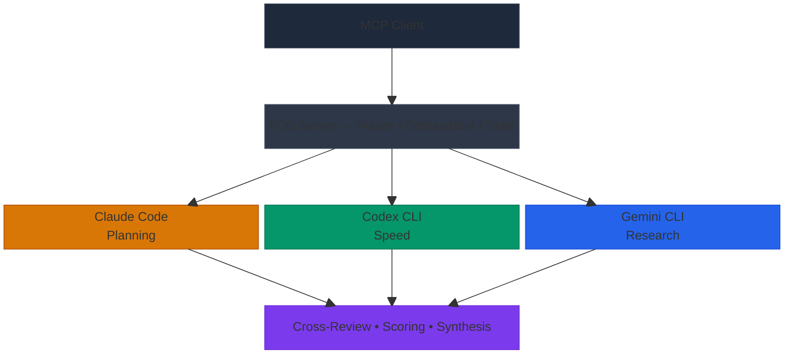

[](LICENSE)
[](https://nodejs.org)
[](https://www.typescriptlang.org)

# AOG — Multi-Agent CLI Orchestrator

**AOG** (Anthropic, OpenAI, Google) is an open-source MCP server that orchestrates Claude Code, Codex CLI, and Gemini CLI as a collaborative multi-agent coding team. Multiple models work the same problem independently, then cross-review and synthesize — applied to CLI coding agents working on real code.



## See It In Action

A single `council_run` dispatched the same task to all three agents in parallel worktrees:

| Agent | What It Built |
|-------|--------------|
| **Claude** | Clean 9-line implementation using `Date.now()` |
| **Codex** | 13-line version with a `HealthStatus` TypeScript interface and `process.uptime()` |
| **Gemini** | 12-line version with JSDoc documentation and `process.uptime()` |

All three implementations were anonymized, cross-reviewed, and scored. The chairman merged the best parts — Codex's type interface with Gemini's docs. Total time: ~82 seconds.

## Prerequisites

- **Node.js** >= 20
- **Git** (for worktree isolation)
- At least one of:
  - [Claude Code](https://claude.ai/code) (Claude Max subscription)
  - [Codex CLI](https://openai.com/codex) (ChatGPT Plus/Pro subscription)
  - [Gemini CLI](https://github.com/google-gemini/gemini-cli) (Google account, free tier available)

> **Don't have all three?** AOG works with any subset — even just one CLI.
> Council mode silently falls back to solo on single-CLI environments
> with a one-time stderr notice. Pass `mode: "solo"` to opt out of
> council on any individual call.

## Setup

### 1. Verify CLIs are installed

```bash
claude --version   # Need 2.1+
codex --version    # Need 0.106+
gemini --version   # Need 0.30+
```

### 2. Verify each CLI is authenticated

Run these one at a time. Each should return JSON and exit cleanly.

```bash
claude -p "say hi" --output-format json --max-turns 1
codex exec "say hi" --full-auto --json
gemini -p "say hi" --output-format json --yolo
```

If Gemini asks for auth, run `gemini` interactively first to complete Google OAuth.

### 3. Install and register AOG

> **Your project must be a git repository.** AOG uses git worktrees for agent isolation. Run `git init` if needed.

**Option A — Install from npm:**

```bash
claude mcp add --transport stdio aog -- npx -y aog-mcp-server
```

> **AOG runs council mode by default** (uses all available CLIs in parallel). For single-agent behavior, pass `mode: "solo"` or set `defaults.mode: solo` in `aog.config.yaml`.

**Option B — Run from source:**

```bash
git clone https://github.com/LonglifeIO/AOG.git
cd AOG
npm install
npm run build
claude mcp add --transport stdio aog -- node /path/to/AOG/dist/index.js
```

### 4. Verify AOG is registered

```bash
claude mcp list   # Should show 'aog'
```

### 5. First test

Ask Claude Code:

> "Use AOG to build a rate limiter for the API endpoints"

AOG runs this as a council by default — every available CLI builds the
feature in parallel git worktrees, cross-reviews, and a chairman merges
the best of each. Three opinions, one call. Pass `mode: "solo"` if you
just want one agent.

## How AOG Works

AOG runs every task as a **council** by default. You ask once; every
available CLI works the problem in parallel git worktrees; outputs are
anonymized and cross-reviewed; a chairman (Claude by default) synthesizes
the best of each into a single result.

When you want a single agent for cost or speed, pass `mode: "solo"` and
AOG routes by task type. When you need multi-stage workflows with
approval gates, use `aog_pipeline`.

## Tools

| Tool | Job | Default behavior |
|------|-----|------------------|
| **`aog_build`** | Implement / fix / refactor a task | Council on every call. `mode: "solo"` for single agent. |
| **`aog_research`** | Investigate a question, write structured findings | Council. Output: `research/{slug}.md`. |
| **`aog_synthesize`** | Turn research into an implementation plan | Council. Output: `docs/IMPLEMENTATION-PLAN.md`. `then_build: true` chains into `aog_build`. |
| **`aog_pipeline`** | Multi-stage YAML workflow | Per-template. For approval gates, conditional stages, custom per-stage agent selection. |
| **`aog_status`** | Inspect a session | Returns progress, diffs, reviews. |
| **`aog_cancel`** | Stop a session | Terminates agents and removes worktrees. |
| `aog_council` | **Deprecated alias** | Forwards to `aog_build` with `mode: "council"`. Removed in v2.1.0. |

### Operations are independent

Research, synthesize, and build are separate calls. The MCP client
chains them — there's no forced pipeline. For from-scratch work,
`aog_research` → `aog_synthesize` → `aog_build` works as three explicit
calls. To shortcut the latter two, pass `then_build: true` to
`aog_synthesize` — both phases run council by default.

### Single-agent escape hatch

`mode: "solo"` runs one CLI with the routing-by-strength matrix:

| Tool | task_type | Routes to |
|------|-----------|-----------|
| `aog_build` | IMPLEMENT (default) | Claude |
| `aog_build` | GENERATE | Codex |
| `aog_build` | RESEARCH / REVIEW / ANALYZE | Gemini |
| `aog_build` | DEBUG / REFACTOR / MIGRATE | Claude |
| `aog_research` | (n/a) | Gemini |
| `aog_synthesize` | (n/a) | Claude |

See `docs/routing.md` for the full table including fallbacks. Set
`defaults.mode: solo` in `aog.config.yaml` to flip the global default.

### Single-CLI users

If only one CLI is installed, council mode silently falls back to solo
and prints a one-time stderr notice (`Council mode requires 2+ CLIs;
running solo with claude.`). Every tool works with any subset.

### Pipeline templates

`aog_pipeline` is the customization surface for advanced workflows —
approval gates, conditional stages, per-stage agent selection. For the
common research → plan → build flow, prefer `aog_synthesize` with
`then_build: true`.

Built-in templates available via `aog_pipeline`:

| Template | Stages |
|----------|--------|
| **full-council** | implement → test → cross-review → synthesize → final test |
| **quick-fix** | fix → test → review |
| **migration** | scan → approve → implement → test → review → synthesize |
| **dependency-update** | analyze → update → test → review |
| **research-synthesis** | synthesize → plan → approve → build (custom variant of the `then_build` shortcut, with an interactive approval gate) |

To customize a template, drop a YAML override at `.aog/templates/{name}.yaml`
in your project. AOG loads user overrides first; otherwise the built-in
hardcoded defaults are used.

## Token Efficiency

AOG is designed for token-constrained environments (Claude Pro, API budgets).

- **`task_file` param** — All tools accept `task_file` as an alternative to `task`. Write your spec to a temp file and pass the path instead of inlining thousands of characters. Same result, saves the caller's output tokens.
- **Compact responses** — Tool responses contain only `taskId`, `status`, `summary`, `files_changed`, `duration_ms`, and `session_path`. Full diffs, reviews, and synthesis details go to `.aog/sessions/` on disk. Use `council_status` with `detail_level: "diffs"` or `"full"` to retrieve more.
- **Lean prompts** — Worker instructions, cross-review prompts, and synthesis prompts are minimized. Reviews use `git diff --stat` instead of full diffs.
- **Debug logging** — Set `AOG_DEBUG_TOKENS=true` to log token estimates (chars/4) per session in `.aog/sessions/{taskId}.json`.

## Live Progress

AOG pushes MCP progress notifications throughout every run, including a
heartbeat during long agent spawns so you never stare at a silent spinner.
A council run (the default) looks like this:

```
Council started — 3 agents (claude, codex, gemini)
Worktrees created for claude, codex, gemini
claude: implementing…
codex: implementing…
gemini: implementing…
claude:5s ⟳ | codex:5s ⟳ | gemini:5s ⟳
claude:10s ⟳ | codex:10s ⟳ | gemini:10s ⟳
claude:15s ⟳ | codex:15s ✓ 2f | gemini:15s ⟳
codex: done (15s, 2 files changed)
claude:20s ⟳ | codex:15s ✓ 2f | gemini:20s ⟳
gemini: done (24s, 4 files changed)
claude: done (28s, 3 files changed)
Running tests…
Tests: 3/3 agents passed
Cross-review started (claude, codex, gemini)
Cross-review complete
Chairman claude synthesizing…
Synthesis complete (best-wins)
```

Solo runs (`mode: "solo"`) emit a per-agent heartbeat every ~8s with
elapsed time. Pipeline sequential stages emit one per stage. The icons:

- `⟳` running
- `✓` completed
- `✗` failed
- `2f` files-changed counter once a worktree is committed

Every notification also lands in `.aog/sessions/{taskId}.json` so you can
replay a run after the fact.

## Submodule Support

Git worktrees automatically run `git submodule update --init --recursive` after creation, so projects with submodules (e.g. shared libraries tracked as separate repos) work out of the box.

## Security

- **Spawns official CLI binaries only** — no OAuth token extraction, no SDK auth hacks
- **Git worktree isolation** — each agent works in its own directory
- **Output sanitization** — strips prompt injection patterns between agents
- **Approval gates** — configurable human-in-the-loop at critical pipeline stages
- **Audit logging** — all operations logged to `.aog/sessions/`

## Configuration

Create `aog.config.yaml` in your project root:

```yaml
agents:
  claude:
    enabled: true
    model: sonnet
    maxTurns: 20
    maxBudgetUsd: 5.0
  codex:
    enabled: true
    model: gpt-5.4
  gemini:
    enabled: true
    model: gemini-2.5-pro

defaults:
  mode: council        # 'council' (default) or 'solo' — global default for build/research/synthesize
  chairman: claude
  timeout: 300000
  pipeline: full-council

security:
  require_approval_before_merge: true
  allow_permission_bypass: true
  max_parallel_agents: 3
  max_budget_per_task_usd: 10.0
  audit_logging: true
```

## Development

```bash
git clone https://github.com/LonglifeIO/AOG.git
cd AOG
npm install
npm run build   # Compile TypeScript
npm run dev     # Start MCP server with tsx
```

## Migration from v1.x

v2.0.0 makes council the default for `aog_build`, `aog_research`, and
`aog_synthesize`. If you scripted against v1.x:

| What you did | What to do now |
|--------------|----------------|
| Called `aog_build` and expected single-agent behavior | Pass `mode: "solo"`, or set `defaults.mode: solo` in `aog.config.yaml`. |
| Called `aog_council` for multi-agent runs | Continue calling `aog_council` — it's now a deprecation alias forwarding to `aog_build` with `mode: "council"`. Removed in v2.1.0. Migrate to `aog_build` directly. |
| Called `council_delegate`, `council_run`, `council_pipeline`, `council_status`, or `council_cancel` | These v1.x legacy aliases are **removed** in v2.0.0. Use `aog_build` (with `mode: "solo"`), `aog_build` (council by default), `aog_pipeline`, `aog_status`, and `aog_cancel` respectively. |

The default-behavior change is breaking at the cost/latency level —
council mode runs every available CLI in parallel and uses
2-3× the tokens of solo for a single call. The trade-off is a chairman
synthesis that merges the best of each. Solo remains a one-flag opt-out.

## Not Yet Built

- `aog init` setup wizard
- Container isolation mode
- Pipeline resume after approval pause
- Metrics / learned adaptive routing

## Contributing

This project is in early development. Issues, bug reports, and PRs welcome.
See `docs/decisions/` for architecture context before making major changes.

## Troubleshooting

- **"MCP failed to reconnect"** → Rebuild with `npm run build`, then re-register with `claude mcp add`
- **Gemini auth error** → Run `gemini` interactively to complete Google OAuth, then retry
- **Codex timeout** → Check your ChatGPT Plus/Pro subscription is active
- **AOG works with any subset of CLIs** — you don't need all three installed

## License

MIT
